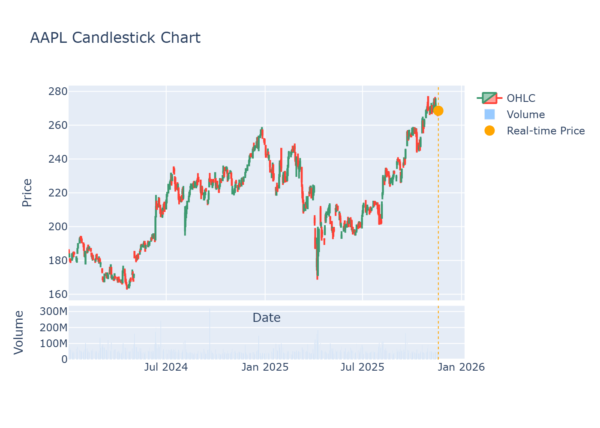

# Stock Market Analysis and Real-Time Monitoring



Static preview generated via `--candlestick --include-volume`. See the interactive version: [aapl_candles_latest.html](aapl_candles_latest.html).

This project fetches historical and live stock data (Yahoo Finance via `yfinance`), trains an LSTM model for next-price forecasting, visualizes results, and provides operational tooling: live plots, metadata export, periodic daemon logging, and a Flask web UI. Big-data style aggregation is demonstrated with Dask (and optional PySpark if Java is installed). It also supports interactive Plotly candlestick charts with optional volume and multi‑ticker dashboards.

## Key Features

- Historical data download (`--start --end` or defaults)
- Real-time price fetch with clear annotation & metadata (`--output-meta`)
- Optional LSTM training (skip with `--no-train` for fast mode)
- Future price prediction (iterative next-step)
- Matplotlib visualization (static or `--live` updating)
- Plotly candlestick charts (`--candlestick`) with `--include-volume` and HTML export
- Plot controls: hide predictions, realtime-only, size tuning
- Multi-ticker aggregation using Dask (mean close prices)
- Optional PySpark path (guarded; requires Java)
- Daemon mode for continuous polling & JSONL logging
- Flask web app (`web_app.py`) with `/api/price` JSON endpoint
- Training controls: epochs, batch size, early stopping, checkpoints
 - Fault tolerance on downloads (retry/backoff flags)

## Requirements

- Python 3.11+
- Dependencies listed in `requirements.txt`

Install (Conda env recommended):
```powershell
pip install -r requirements.txt
```

## Quick Start

Fast real-time only (no training, no plot, save metadata):
```powershell
python main.py --ticker AAPL --no-train --no-plot --output-meta meta.json
```

Train a small model & plot with realtime marker:
```powershell
python main.py --ticker TSLA --epochs 5 --batch-size 32
```

Run live updating plot while training (refresh every 5s):
```powershell
python main.py --ticker NVDA --live 5 --epochs 8 --batch-size 16
```

Multi-ticker aggregation only (skip training):
```powershell
python main.py --tickers AAPL MSFT GOOGL --no-train --no-plot
```

Start daemon (3 entries then exit):
```powershell
python main.py --ticker AAPL --daemon --daemon-interval 5 --daemon-max-lines 3 --daemon-log daemon_log.jsonl
```

Launch web UI:
```powershell
python web_app.py --ticker AAPL --port 5050
```
Visit: http://localhost:5050

Single fetch without server:
```powershell
python web_app.py --ticker AAPL --once
```

## CLI Flags Overview

Data & Selection:
- `--ticker SYMBOL` (default AAPL)
- `--tickers AAPL MSFT GOOGL` (multi for Dask/Spark aggregation)
- `--start YYYY-MM-DD` / `--end YYYY-MM-DD`

Training:
- `--no-train` skip model build & training
- `--epochs N` (default 10)
- `--batch-size N` (default 32)
- `--early-stop-patience N` enable EarlyStopping if provided
- `--checkpoint FILE` save best model weights

Prediction & Visualization:
- `--no-plot` disable plotting entirely
- `--plot-realtime-only` show just historical + realtime point
- `--realtime-marker-size N` customize marker size
- `--live` live updating matplotlib plot during training/monitoring

Metadata & Output:
- `--output-meta FILE` write realtime snapshot JSON

Daemon Mode:
- `--daemon` enable looped realtime polling
- `--daemon-interval SECONDS`
- `--daemon-log FILE` JSONL output path
- `--daemon-max-lines N` exit after N lines (for testing)

Web App (`web_app.py`):
- `--ticker` select symbol
- `--port` bind port (default 5050)
- `--once` fetch one JSON snapshot then exit

Candlestick & HTML:
- `--candlestick` show interactive OHLC candlesticks (Plotly)
- `--include-volume` add volume bars under candles
- `--save-html FILE` export interactive chart as a self‑contained HTML
- `--hide-realtime` hide the realtime marker/guideline
- `--forecast-candles N` overlay N synthetic future candles (requires trained predictions)
- `--multi-candle-html FILE` generate a multi‑ticker dashboard (uses `--tickers`)

Download Robustness:
- `--download-retries N` number of retries on rate limit/timeouts (default 2)
- `--download-retry-sleep SECONDS` backoff between retries (default 5)

LSTM Input Window:
- `--sequence-length N` timesteps per training sample (default 60). If history is too short, the run falls back to `--no-train` automatically.

## Project Structure

- `main.py` core pipeline & CLI
- `web_app.py` Flask UI & API endpoint
- `stock_analysis.ipynb` exploratory notebook
- `requirements.txt` dependencies
- `README.md` documentation

## Real-Time Identification

Plots annotate the latest fetched realtime price (orange marker). Metadata JSON includes `fetched_at` (UTC), `timestamp` (exchange time), and `source`.

Example metadata file (`meta.json`):
```json
{
	"ticker": "AAPL",
	"price": 267.46,
	"timestamp": "2025-11-17T00:00:00-05:00",
	"source": "yfinance",
	"fetched_at": "2025-11-18T15:11:07.123456Z"
}
```

## Daemon Logging Format

Each line is a JSON object: `{ "ticker": ..., "price": ..., "timestamp": ..., "fetched_at": ... }` allowing tailing & ingestion.

## Optional PySpark

To enable Spark aggregation:
1. Install Java (JDK 8+)
2. Set `JAVA_HOME` environment variable to JDK path
3. Re-run script; Spark block will attempt a session

If Java missing, Spark gracefully skips with a warning.

## Checkpoints & Early Stopping

Use `--checkpoint model.h5` to persist best weights. Combine with `--early-stop-patience 3` to stop when validation ceases improving (patience counted on loss in this minimal setup).

## Extensibility Ideas

- Add technical indicators (RSI, MACD) before modeling
- Introduce train/validation split for more robust early stopping
- Serve predictions via additional Flask endpoints
- Containerize with Docker for deployment

## Notes & Disclaimer

This project is educational. Real-world trading requires broader data, risk controls, and validation. Predictions are not investment advice.

## License

No explicit license provided; treat as personal/educational use unless clarified.

---

## Big Data Concepts Used

- Parallel processing (Dask): Multi‑ticker aggregation runs via a Dask DataFrame (`npartitions=4`) to compute means in parallel; easily scalable to a Dask cluster.
- Distributed processing (Spark‑ready): Same combined dataset is converted to a Spark DataFrame and queried with SQL; guarded with try/except and skipped if Java/Spark is unavailable.
- Batch vs streaming: Historical fetch + optional training are batch; daemon mode performs micro‑batch streaming (polling) and appends JSON lines for ingestion.
- Schema‑on‑read: `fetch_ohlc_data` flattens yfinance’s MultiIndex OHLC to tidy columns on read, enabling flexible downstream processing without rigid schemas.
- Fault tolerance: `--download-retries` and `--download-retry-sleep` handle rate‑limit/timeouts; if data remains empty, the run exits cleanly before training.
- Append‑only logs: Daemon writes newline‑delimited JSON (`.jsonl`) ideal for scalable ingestion by Spark/Dask (`read_json(lines=True)`).
- Decoupled serving: Flask app exposes `/api/price` for real‑time data, separating compute from serving and mirroring microservice patterns.

## Candlestick Quick Examples

Single ticker with volume, save HTML:
```powershell
python main.py --ticker AAPL --no-train --candlestick --include-volume --start 2024-01-01 --end 2025-11-19 --save-html aapl_candles.html
```

Forecast overlay (requires model training):
```powershell
python main.py --ticker AAPL --candlestick --include-volume --forecast-candles 5 --epochs 1 --batch-size 1 --start 2024-01-01 --end 2025-11-19 --save-html aapl_forecast_candles.html
```

Multi‑ticker dashboard:
```powershell
python main.py --no-train --candlestick --include-volume --tickers AAPL,GOOGL,MSFT --multi-candle-html tech_grid.html --start 2024-01-01 --end 2025-11-19 --hide-realtime
```